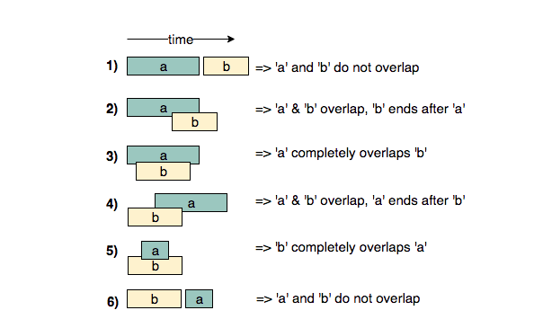

# Pattern: Merge Intervals

The merge interval pattern describes an efficient technique to deal with overlapping intervals. In a lot of problems involving intervals, we either need to find overlapping intervals or merge intervals if they overlap.

Given two intervals (`a` and `b`), there will be six different ways the two intervals can relate to each other:

1. `a` and `b` do not overlap, `a` starts before `b`.
2. `a` and `b` overlap, `b` ends after `a`.
3. `a` fully overlaps `b`, `a` starts before or at the same time with `b`.
4. `a` and `b` overlap, `a` ends after `b`.
5. `b` fully overlaps `a`, `b` starts before or at the same time with `a`.
6. `a` and `b` do not overlap, `b` starts before `a`.

_Credit: [Coding Interview Pattern: Merge Interval](https://medium.com/codex/grokking-the-coding-interview-pattern-merge-interval-6e6b1e9e038c)_

## Problems

|                  Problem                   |   Complexity    |
| :----------------------------------------: | :-------------: |
| [Merge Intervals](./01-merge-intervals.md) | :star2: :star2: |
